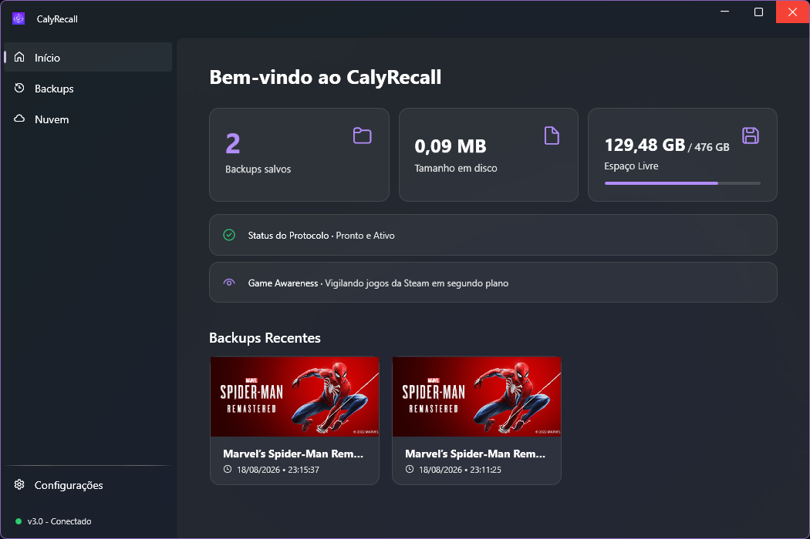
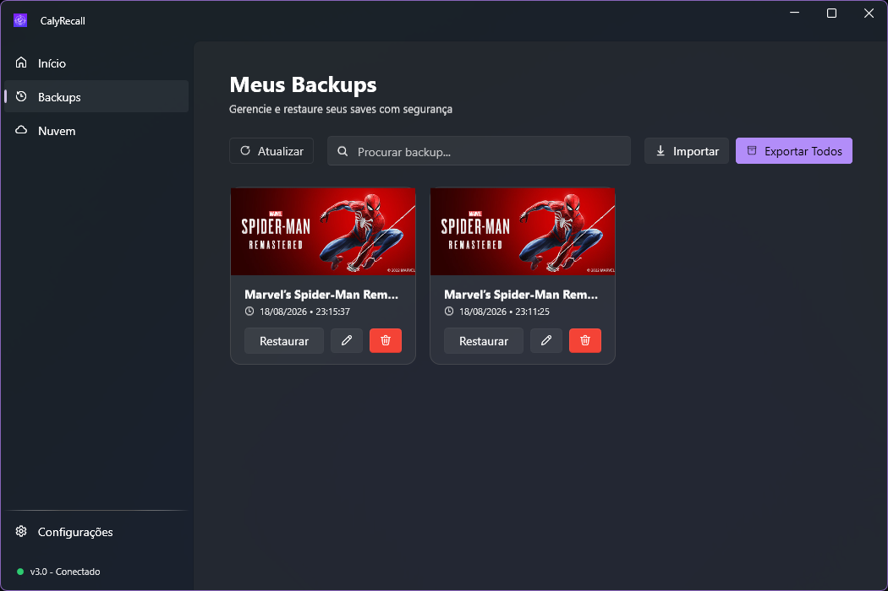
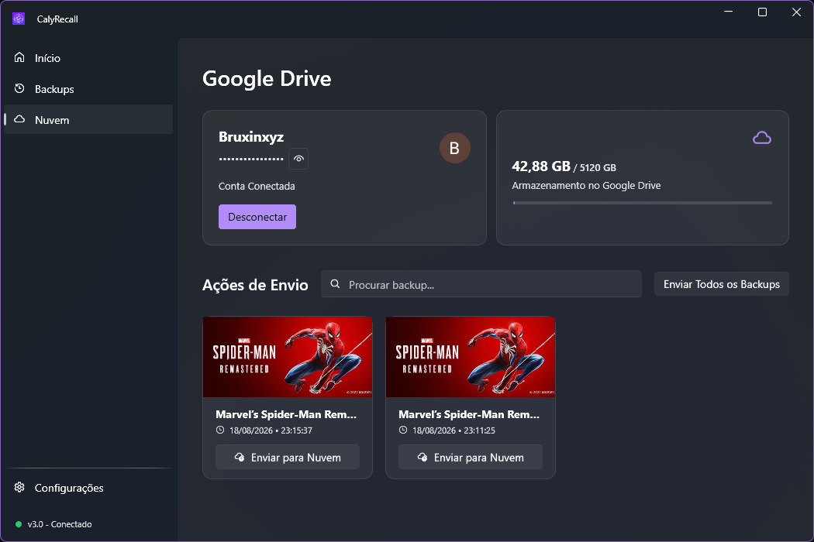
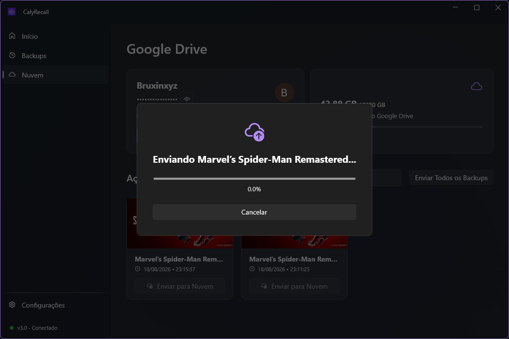
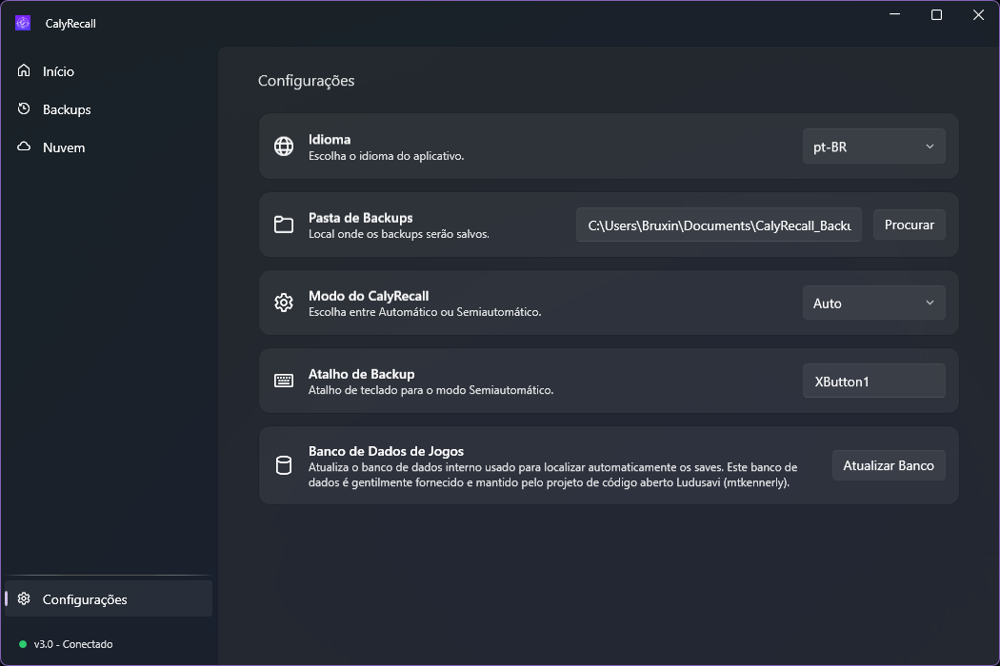

<div align="center">

<!-- LOGO -->


# CalyRecall

**Never lose a save again.**

A native Windows application that automatically backs up your Steam game saves — silently, smartly, and in real time.

[](https://dotnet.microsoft.com/)
[](https://docs.microsoft.com/en-us/dotnet/desktop/wpf/)
[](LICENSE)
[](https://store.steampowered.com/)

---

[Features](#-features) · [Screenshots](#-screenshots) · [Installation](#-installation) · [How It Works](#-how-it-works) · [Tech Stack](#-tech-stack) · [Credits](#-credits)

</div>

---

## ✨ Features

### 🎮 Game Awareness — Real-Time Steam Monitoring
CalyRecall runs a lightweight background service that continuously monitors your Steam client through the Windows Registry. The moment it detects that a game session has ended (i.e., the game process has closed), it automatically kicks off the backup pipeline. You don't need to remember to save — CalyRecall is always watching, silently and with zero impact on game performance.

### 🧠 Smart Save Detection — Powered by Ludusavi's Database
Finding where each game stores its save files is one of the hardest problems in game backup. Every game does it differently — some use `AppData`, others use `Documents`, some bury saves deep inside the Steam userdata folder.

CalyRecall solves this by using the open-source game save database maintained by the [Ludusavi](https://github.com/mtkennerly/ludusavi) project (by [mtkennerly](https://github.com/mtkennerly)). This community-driven manifest maps thousands of games to their exact save file locations. CalyRecall downloads and parses this database locally, and you can update it at any time with a single click from the Settings page.

> **Note:** CalyRecall only uses Ludusavi's public manifest database for save path resolution. Ludusavi is a separate, independent project — we are grateful for their incredible work maintaining this database.

### ⚡ Three Backup Modes — Your Game, Your Rules
CalyRecall adapts to how you play:

| Mode | How It Works |
|------|-------------|
| **🤖 Automatic** | The default mode. CalyRecall silently backs up your saves every time you close a game. No prompts, no interruptions — it just works in the background. |
| **🔔 Semi-Automatic** | After each game session, CalyRecall shows a notification asking if you'd like to save a backup. You choose to save or discard — perfect for players who want control without manual effort. |
| **⌨️ Manual** | Assign a custom hotkey (default: `Ctrl+Shift+S`) and trigger a backup whenever you want. Ideal for games where you want to capture a specific moment. |

### ☁️ Google Drive Sync — Your Saves in the Cloud
Connect your Google account directly through CalyRecall and sync your backups to Google Drive. The cloud page shows your connected account, available storage space, and lets you upload backups individually (per game) or all at once. A real-time progress modal tracks compression and upload progress, with the ability to cancel at any time.

### 📦 Import & Export — Portable Backup Archives
Export all your backups into a single compressed `.zip` file — perfect for migrating to a new PC, sharing saves with a friend, or just keeping an offline archive. Import works the same way: select a `.zip` and CalyRecall extracts everything back into your backup folder, fully organized.

### 🔎 Search & Manage — Full Control Over Your Backups
The Backups page gives you a complete view of all your saved games with cover art fetched directly from the Steam API. You can search by game name, restore saves to their original location, edit backup names and folder names, or delete backups you no longer need. Bulk selection is supported for batch operations.

### 🌐 Multi-Language — Switch on the Fly
CalyRecall is fully localized in **Portuguese (pt-BR)**, **English (en-US)**, and **Spanish (es-ES)**. Every label, button, toast notification, and error message is translated. You can switch languages instantly from the Settings page — no restart required.

### 🔔 System Tray — Set It and Forget It
CalyRecall lives in your system tray and stays out of your way. Minimize the app and it keeps running silently, sending native Windows toast notifications for important events like completed backups, cloud sync status, and errors. Right-click the tray icon to quickly access the app or exit.

### 🎨 Modern Dark UI — Built with Fluent Design
The interface follows Windows 11's Fluent Design language with a sleek dark theme, smooth animations, and a clean sidebar navigation. Every page is designed to be intuitive — from the dashboard that shows stats at a glance, to the cloud page with real-time upload progress.

---

## 📸 Screenshots

<div align="center">

### Dashboard


### Backups


### Google Drive


### Cloud Upload


### Settings


</div>

---

## 📥 Installation

### Installer (Recommended)
1. Download the latest `CalyRecall_Setup_X.X.X.exe` from [Releases](https://github.com/BruxinCore/CalyRecall/releases).
2. Run the installer — it supports Portuguese, English, and Spanish.
3. Optionally enable **Start with Windows** during setup.
4. Done. CalyRecall will start monitoring your games.

### Build from Source
```bash
git clone https://github.com/BruxinCore/CalyRecall.git
cd CalyRecall
dotnet publish -c Release -r win-x64 --self-contained true -o ./publish
```

---

## ⚙️ How It Works

```
Steam game closes
       │
       ▼
CalyRecall detects the exit via Windows Registry polling
       │
       ▼
Steam API is queried for the game name and cover art
       │
       ▼
Ludusavi manifest resolves the save file paths for that game
       │
       ▼
Save files are copied to the local backup folder with metadata
       │
       ▼
(Optional) Backup is compressed and uploaded to Google Drive
```

**The pipeline in detail:**

1. **SteamMonitorService** polls the Steam registry key every 3 seconds to detect which game is running. When a previously running game is no longer detected, the backup flow begins.
2. **BackupManager** queries the Steam Web API to fetch the game's official name and cover image, then delegates to **GameSavePathResolver** which parses the locally cached Ludusavi manifest to find all known save file paths for that Steam App ID.
3. Save files are copied to `Documents/CalyRecall_Backups/<GameName>/` along with a `caly_meta.json` file that stores the game name, app ID, cover URL, and backup timestamp.
4. If Google Drive is connected, the **CloudDriveService** handles OAuth2 authentication via Google's API, compresses the selected backups into a zip, and uploads them with chunked progress tracking.

---

## 🛠️ Tech Stack

| Component | Technology |
|-----------|------------|
| **Framework** | .NET 8 (WPF) |
| **UI Library** | [WPF UI (Fluent)](https://github.com/lepoco/wpfui) |
| **Architecture** | MVVM (CommunityToolkit.Mvvm) |
| **Cloud Storage** | Google Drive API v3 |
| **Save Detection** | [Ludusavi Manifest](https://github.com/mtkennerly/ludusavi-manifest) (database only) |
| **Steam Integration** | Windows Registry + Steam Web API |
| **Installer** | Inno Setup 6 |
| **Target** | Windows 10/11 (x64) |

---

## 📁 Project Structure

```
CalyRecall/
├── Assets/                  # App icons
├── Controls/                # Custom WPF controls
├── Dictionaries/            # Localization (pt-BR, en-US, es-ES)
├── Helpers/                 # Utility classes
├── Models/                  # Data models (AppConfig, BackupItem)
├── Services/
│   ├── BackupManager.cs         # Core backup logic
│   ├── CloudDriveService.cs     # Google Drive integration
│   ├── GameSavePathResolver.cs  # Ludusavi manifest parser
│   ├── SettingsService.cs       # App config persistence
│   ├── SteamMonitorService.cs   # Background game monitoring
│   ├── SteamService.cs          # Steam registry reader
│   └── TrayIconService.cs       # System tray management
├── ViewModels/              # MVVM ViewModels
├── Views/
│   ├── MainWindow.xaml          # App shell with navigation
│   └── Pages/
│       ├── DashboardPage.xaml   # Home screen with stats
│       ├── RestorePage.xaml     # Backup management
│       ├── CloudPage.xaml       # Google Drive sync
│       └── SettingsPage.xaml    # App configuration
├── screenshots/             # README images
└── setup.iss                # Inno Setup installer script
```

---

## 🙏 Credits

- **[Ludusavi Manifest](https://github.com/mtkennerly/ludusavi-manifest)** by [mtkennerly](https://github.com/mtkennerly) — CalyRecall uses Ludusavi's open-source game save database to automatically resolve save file locations for thousands of Steam games. This incredible community-maintained manifest is what makes automatic save detection possible. Ludusavi is a separate, independent project — we only consume their publicly available database.
- **[WPF UI](https://github.com/lepoco/wpfui)** by [lepoco](https://github.com/lepoco) — Modern Fluent Design UI framework for WPF.
- **[CommunityToolkit.Mvvm](https://github.com/CommunityToolkit/dotnet)** — MVVM source generators and helpers.
